# Dokumentasi Teknis - Sistem Koperasi Kopi

## 1. User & Cooperative Registration

### 1.1. Ringkasan Tujuan
Modul ini bertanggung jawab untuk menangani proses pendaftaran pengguna (user) dan koperasi. Tujuannya adalah untuk memulai penggunaan sistem dengan memberikan akses yang tepat kepada pengguna koperasi dan menghubungkan mereka ke koperasi yang relevan.

### 1.2. Entitas & Role Terlibat
- **Admin Koperasi**: Orang yang pertama kali mendaftarkan koperasi dan bertanggung jawab atas pengelolaan data koperasi.
- **User**: Pengguna yang memiliki akses ke koperasi (bisa Admin Koperasi atau User biasa). Role-nya ditentukan setelah registrasi.
- **SUPER_ADMIN**: Role yang memiliki akses ke seluruh data koperasi nasional, hanya digunakan oleh kementerian atau pihak pengelola.

### 1.3. Alur Proses Utama

#### Diagram Flowchart:
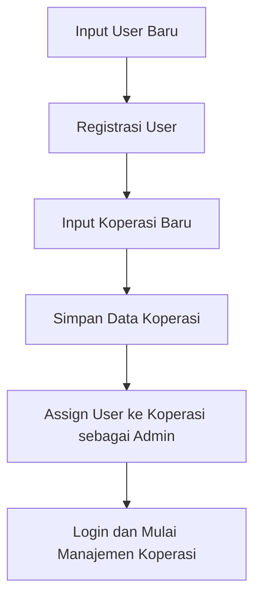

#### Langkah-langkah Proses:

1. **Input User Baru**
   - Admin koperasi memasukkan data diri (username, password, data diri).

2. **Registrasi User**
   - Sistem memvalidasi data, menyimpan informasi pengguna, dan mengatur status "aktif" jika data valid.

3. **Input Koperasi Baru**
   - Admin memasukkan data koperasi (nama koperasi, alamat, provinsi, kabupaten, penanggung jawab).

4. **Simpan Data Koperasi**
   - Data koperasi disimpan dalam sistem, dan koperasi baru dibuat.

5. **Assign User ke Koperasi sebagai Admin**
   - Sistem menghubungkan pengguna dengan koperasi dan menetapkan mereka sebagai Admin.

6. **Login dan Mulai Manajemen Koperasi**
   - User dapat login untuk mengelola data koperasi dan mulai memasukkan informasi lebih lanjut.

### 1.4. Input Data

| Field | Tipe | Sumber | Validasi | Wajib | Keterangan |
|-------|------|--------|----------|-------|------------|
| username | string | Admin | Unique, min 5 chars | Ya | Username untuk login |
| password | string | Admin | Enkripsi, min 8 chars | Ya | Password terenkripsi |
| nama_lengkap | string | Admin | Huruf, spasi | Ya | Nama lengkap user |
| email | string | Admin | Format email valid | Ya | Email yang dapat digunakan untuk reset password |
| koperasi_name | string | Admin | Unique | Ya | Nama koperasi yang didaftarkan |
| koperasi_address | string | Admin | - | Ya | Alamat lengkap koperasi |
| koperasi_province | string | Admin | - | Ya | Provinsi koperasi |
| koperasi_district | string | Admin | - | Ya | Kabupaten/Kota koperasi |

### 1.5. Proses & Bisnis Logika

- **Validasi User**: Sistem memvalidasi username, password, dan memastikan data unik.
- **Registrasi Koperasi**: Sistem menyimpan data koperasi dengan menghubungkannya dengan pengguna yang mendaftar sebagai admin.
- **Role Assignment**: Admin koperasi diberikan hak penuh, sementara user biasa memiliki hak terbatas.

### 1.6. Output Data

| Field | Tipe | Destinasi | Format/Note |
|-------|------|-----------|-------------|
| user_id | integer | Sistem | ID unik pengguna |
| koperasi_id | integer | Sistem | ID koperasi |
| role | string | Sistem | 'ADMIN' atau 'USER' |
| status | string | Sistem | 'active' |
| last_login | timestamp | Sistem | Tanggal login terakhir |

### 1.7. State/Status Diagram

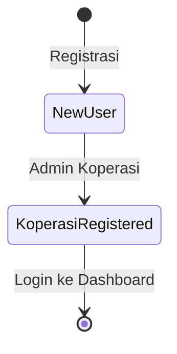

### 1.8. Contoh Kasus/Alur

**Kasus 1: User Mendaftar Koperasi Baru**

1. Admin memasukkan username dan password untuk user, kemudian data koperasi dimasukkan (nama koperasi, alamat, dll).
2. Setelah sukses, user bisa login dengan akses sebagai admin koperasi yang baru dibuat.

### 1.9. Catatan Kritis & Batasan

- Jika username sudah terdaftar, sistem menampilkan error dan meminta pengguna memilih username baru.
- Jika data koperasi tidak lengkap, registrasi ditolak.

---

## 2. Petani Registration

### 2.1. Ringkasan Tujuan
Modul ini memungkinkan admin koperasi untuk mendaftarkan petani yang mengelola lahan. Tujuannya adalah untuk mencatat setiap petani dalam sistem untuk keperluan traceability dan pengelolaan sumber daya.

### 2.2. Entitas & Role Terlibat
- **Admin Koperasi**: Orang yang mendaftarkan petani.
- **Petani**: Pemilik lahan yang mendaftar untuk mengelola tanaman kopi.

### 2.3. Alur Proses Utama

#### Diagram Flowchart:
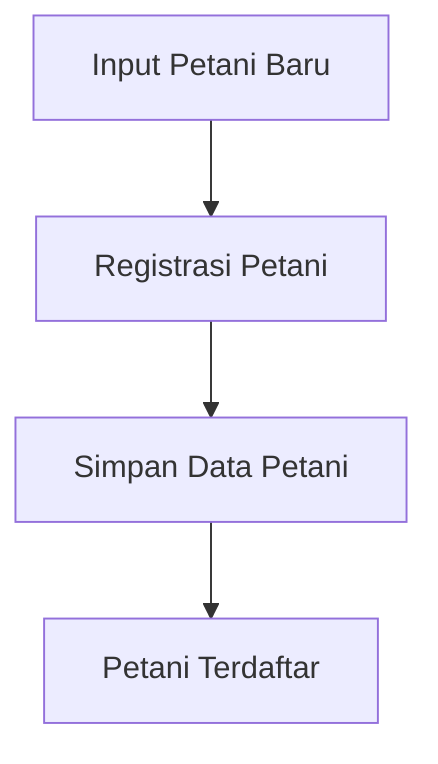

#### Langkah-langkah Proses:

1. **Input Petani Baru**
   - Admin koperasi memasukkan nama petani, nomor kontak, dan alamat.

2. **Registrasi Petani**
   - Sistem memvalidasi data dan menyimpannya ke dalam database.

3. **Simpan Data Petani**
   - Data petani berhasil tersimpan dalam sistem dan ditetapkan ke koperasi terkait.

4. **Petani Terdaftar**
   - Sistem memberi feedback bahwa petani telah berhasil terdaftar dan siap untuk dikelola lahan/aktivitasnya.

### 2.4. Input Data

| Field | Tipe | Sumber | Validasi | Wajib | Keterangan |
|-------|------|--------|----------|-------|------------|
| nama_petani | string | Admin | - | Ya | Nama lengkap petani |
| nomor_telepon | string | Admin | Format valid | Ya | Nomor kontak petani |
| alamat | string | Admin | - | Ya | Alamat lengkap petani |
| koperasi_id | integer | Admin | - | Ya | ID koperasi yang mendaftarkan |

### 2.5. Proses & Bisnis Logika

- **Validasi Data**: Sistem memeriksa kelengkapan data petani (nama, nomor telepon, alamat) sebelum menyimpannya.
- **Simpan Data Petani**: Sistem menyimpan data petani dan mengaitkannya dengan koperasi.

### 2.6. Output Data

| Field | Tipe | Destinasi | Format/Note |
|-------|------|-----------|-------------|
| petani_id | integer | Sistem | ID unik petani |
| koperasi_id | integer | Sistem | ID koperasi |
| nama_petani | string | Sistem | Nama petani |

### 2.7. State/Status Diagram

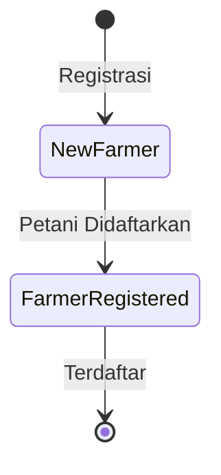

### 2.8. Contoh Kasus/Alur

**Kasus 1: Admin Mendaftarkan Petani Baru**

1. Admin koperasi memasukkan informasi petani, sistem memvalidasi dan menyimpannya.
2. Setelah itu, petani terdaftar dalam sistem dan siap untuk mendaftar lahan.

### 2.9. Catatan Kritis & Batasan

- Sistem hanya menerima nomor telepon dalam format yang valid.
- Jika data petani sudah ada, sistem menampilkan pesan error.

---

## 3. Lahan Registration & Status Assignment

### 3.1. Ringkasan Tujuan
Modul ini memungkinkan admin koperasi untuk mendaftarkan lahan yang akan dikelola. Tujuannya adalah untuk mencatat lahan yang ada, jenis kopi yang ditanam, serta status dan estimasi panen.

### 3.2. Entitas & Role Terlibat
- **Admin Koperasi**: Orang yang mendaftarkan lahan.
- **Lahan**: Unit tanah yang dikelola oleh petani untuk menanam kopi.

### 3.3. Alur Proses Utama

#### Diagram Flowchart:
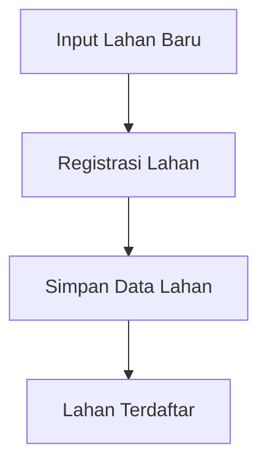

#### Langkah-langkah Proses:

1. **Input Lahan Baru**
   - Admin koperasi memasukkan data lahan (nama, lokasi, luas, jumlah pohon, jenis kopi).

2. **Registrasi Lahan**
   - Sistem memvalidasi data lahan dan menyimpannya dalam database.

3. **Simpan Data Lahan**
   - Sistem mengaitkan lahan dengan petani tertentu dan memperbarui status lahan.

4. **Lahan Terdaftar**
   - Lahan terdaftar dalam sistem dan siap untuk dikelola.

### 3.4. Input Data

| Field | Tipe | Sumber | Validasi | Wajib | Keterangan |
|-------|------|--------|----------|-------|------------|
| nama_lahan | string | Admin | - | Ya | Nama atau kode identifikasi lahan |
| lokasi | string | Admin | - | Ya | Lokasi lahan (optional GPS) |
| luas_hektar | decimal | Admin | > 0 | Ya | Luas lahan dalam hektar |
| estimasi_pohon | integer | Admin | > 0 | Ya | Estimasi jumlah pohon kopi |
| jenis_kopi | string | Admin | - | Ya | Jenis kopi (Arabika, Robusta, dll) |
| petani_id | integer | Admin | - | Ya | ID petani yang mengelola lahan |

### 3.5. Proses & Bisnis Logika

- **Validasi Data Lahan**: Sistem memeriksa kelengkapan data lahan dan kesesuaiannya dengan data petani.
- **Simpan Data Lahan**: Sistem menyimpan lahan, menghubungkannya dengan petani yang relevan.

### 3.6. Output Data

| Field | Tipe | Destinasi | Format/Note |
|-------|------|-----------|-------------|
| lahan_id | integer | Sistem | ID unik lahan |
| petani_id | integer | Sistem | ID petani terkait |
| nama_lahan | string | Sistem | Nama lahan |

### 3.7. State/Status Diagram

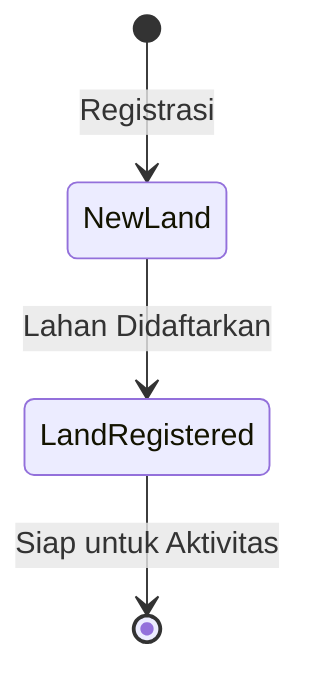

### 3.8. Contoh Kasus/Alur

**Kasus 1: Admin Mendaftarkan Lahan**

1. Admin koperasi memasukkan informasi lahan, sistem memvalidasi dan menyimpannya.
2. Setelah itu, lahan siap digunakan untuk pencatatan aktivitas tanam dan panen.

### 3.9. Catatan Kritis & Batasan

- Lahan tidak boleh terdaftar dua kali dalam koperasi yang sama.
- Status lahan: "Baru Ditanam" jika pertama kali, "Produktif" jika telah melalui satu kali panen.

---

## 4. Farm Activity Recording (Tanam, Panen, Estimasi Panen)

### 4.1. Ringkasan Tujuan
Modul ini digunakan untuk mencatat aktivitas budidaya utama pada lahan kopi, yaitu Tanam, Panen, dan Estimasi Panen. Tujuannya adalah untuk melacak milestone budidaya kopi yang penting, memastikan bahwa data terkait lahan dan kopi terekam dengan baik untuk prediksi hasil panen serta analisis produktivitas.

### 4.2. Entitas & Role Terlibat
- **Admin Koperasi**: Orang yang memasukkan data aktivitas pertanian.
- **Petani**: Petani terkait dengan lahan, meskipun petani tidak langsung menginput data ini, mereka berperan dalam aktivitas yang dicatat.
- **Lahan**: Lokasi tempat aktivitas budidaya berlangsung (terhubung langsung dengan data petani).

### 4.3. Alur Proses Utama

#### Diagram Flowchart:
```mermaid
flowchart TD
    A[Input Aktivitas Tanam] --> B[Record Aktivitas Tanam]
    B --> C[Estimasi Panen Pertama (auto/manual)]
    C --> D[Update Dashboard Lahan]

    E[Input Aktivitas Panen] --> F[Record Aktivitas Panen]
    F --> G[Buat Batch ID Cherry]
    G --> H[Update Dashboard & Inventory]
    F --> I[Estimasi Panen Berikutnya (auto/manual)]
    I --> H

    J[Input Estimasi Panen] --> K[Record Estimasi Panen]
    K --> L[Update Dashboard Estimasi Panen]
```

#### Langkah-langkah Proses:

1. **Input Aktivitas Tanam**
   - Admin koperasi memasukkan data tanam: tanggal tanam, jenis bibit, jumlah bibit.
   - Sistem menyimpan data aktivitas tanam dan menghitung estimasi panen pertama.

2. **Input Aktivitas Panen**
   - Admin koperasi memasukkan data panen: tanggal panen dan jumlah hasil (kg cherry).
   - Sistem membuat batch ID untuk hasil panen dan mengaitkan batch cherry dengan lahan dan tanggal panen.

3. **Input Estimasi Panen**
   - Admin koperasi menginput estimasi panen berikutnya berdasarkan data sebelumnya atau input manual.
   - Sistem memperbarui estimasi panen pada lahan dan menampilkan estimasi pada dashboard koperasi dan kementerian.

### 4.4. Input Data

| Field | Tipe | Sumber | Validasi | Wajib | Keterangan |
|-------|------|--------|----------|-------|------------|
| nama_lahan | string | Admin | - | Ya | Nama atau kode identifikasi lahan |
| tanggal_tanam | date | Admin | Format valid (YYYY-MM-DD) | Ya | Tanggal aktivitas tanam |
| jenis_bibit | string | Admin | - | Ya | Jenis bibit yang digunakan |
| jumlah_bibit | integer | Admin | > 0 | Tidak | Jumlah bibit yang ditanam |
| tanggal_panen | date | Admin | Format valid (YYYY-MM-DD) | Ya | Tanggal aktivitas panen |
| jumlah_hasil | decimal | Admin | > 0 | Ya | Jumlah hasil panen (kg cherry) |
| estimasi_panen | date | Admin | Format valid (YYYY-MM-DD) | Tidak | Estimasi tanggal panen berikutnya |

### 4.5. Proses & Bisnis Logika

#### Tanam:
- Aktivitas tanam dicatat dalam sistem dengan tanggal, jenis bibit, dan jumlah bibit.
- **Estimasi Panen Pertama**: Sistem otomatis menghitung estimasi berdasarkan waktu tanam (misalnya: 24 bulan setelah tanam untuk panen pertama).
- **Simpan Aktivitas Tanam**: Data tanam disimpan dengan status lahan "Baru Ditanam" di dashboard.

#### Panen:
- Admin koperasi mencatat jumlah hasil panen dan tanggal panen.
- **Batch ID**: Sistem membuat ID untuk batch cherry yang terhubung dengan lahan dan tanggal panen.
- **Estimasi Panen Berikutnya**: Sistem memperbarui estimasi berdasarkan data tanam dan panen sebelumnya.
- **Update Inventory**: Sistem menambah stok cherry di inventory dan memperbaharui status panen.

#### Estimasi Panen:
- Admin koperasi bisa memperbarui estimasi panen berdasarkan kondisi lahan atau data historis.
- **Dashboard Update**: Estimasi panen selanjutnya ditampilkan pada dashboard koperasi dan kementerian.

### 4.6. Output Data

| Field | Tipe | Destinasi | Format/Note |
|-------|------|-----------|-------------|
| aktivitas_id | integer | Sistem | ID unik aktivitas |
| lahan_id | integer | Sistem | ID lahan terkait |
| jenis_aktivitas | string | Sistem | 'TANAM', 'PANEN', 'ESTIMASI' |
| tanggal_aktivitas | date | Sistem | Tanggal kegiatan |
| jumlah_aktivitas_kg | decimal | Sistem | Kg hasil panen (untuk 'PANEN') |
| estimasi_panen | date | Sistem | Tanggal estimasi |
| status | string | Sistem | 'TERJADWAL', 'SELESAI' |

### 4.7. State/Status Diagram

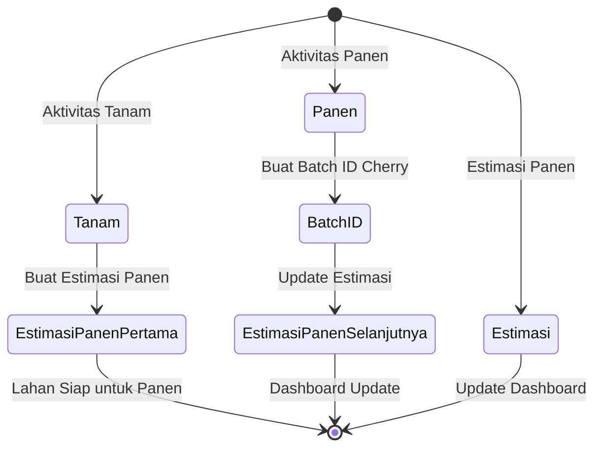

### 4.8. Contoh Kasus/Alur

**Kasus 1: Admin Mencatat Aktivitas Tanam**

1. Admin koperasi memasukkan data aktivitas tanam pada lahan tertentu (jenis bibit, tanggal tanam).
2. Sistem membuat estimasi panen pertama secara otomatis (24 bulan dari tanam).
3. Data aktivitas tanam dicatat dan ditampilkan di dashboard koperasi.

**Kasus 2: Admin Mencatat Aktivitas Panen**

1. Admin koperasi mencatat tanggal panen dan jumlah hasil panen (kg cherry).
2. Sistem membuat batch ID untuk hasil panen dan menambahkannya ke inventory.
3. Estimasi panen berikutnya diperbaharui berdasarkan data historis.

**Kasus 3: Admin Mengupdate Estimasi Panen**

1. Admin koperasi mengubah estimasi tanggal panen untuk lahan tertentu.
2. Sistem memperbaharui estimasi dan menampilkan perubahan di dashboard.

### 4.9. Catatan Kritis & Batasan

- Lahan belum pernah ditanam: Tidak bisa melakukan panen, sistem harus menolak input panen.
- Estimasi panen jauh lebih tinggi/lebih rendah dari nilai historis: Flagged as potential inconsistency for review.

---

## 5. Inventory Management (IN/OUT, Cherry Harvest Entry)

### 5.1. Ringkasan Tujuan
Modul ini bertanggung jawab untuk mengelola stok barang yang masuk dan keluar dari koperasi, terutama terkait dengan barang pertanian (pupuk, benih) dan hasil panen (cherry, green bean). Tujuan utama modul ini adalah untuk menjaga traceability barang dan memfasilitasi transaksi yang terjadi dalam sistem.

### 5.2. Entitas & Role Terlibat
- **Admin Koperasi**: Orang yang mencatat barang masuk dan keluar.
- **Barang Pertanian**: Pupuk, benih, pestisida yang dibeli koperasi.
- **Hasil Panen**: Cherry dan green bean yang dihasilkan oleh petani.

### 5.3. Alur Proses Utama

#### Diagram Flowchart:
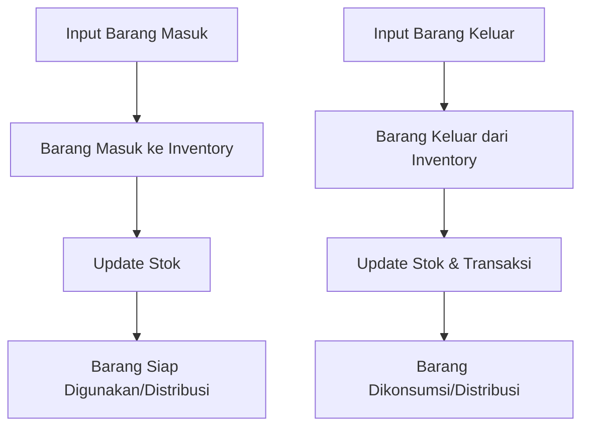

#### Langkah-langkah Proses:

1. **Input Barang Masuk**
   - Admin koperasi mencatat barang yang masuk (pupuk, benih, pestisida, hasil panen).
   - Sistem menambahkannya ke stok barang yang ada.

2. **Barang Siap Digunakan/Distribusi**
   - Barang yang sudah tercatat akan ditampilkan di dashboard dan siap untuk digunakan atau didistribusikan ke petani.

3. **Input Barang Keluar**
   - Admin koperasi mencatat barang yang keluar (distribusi ke petani, penjualan ke buyer).
   - Sistem mengurangi stok barang dan memperbarui transaksi.

4. **Barang Dikonsumsi/Distribusi**
   - Barang yang dikeluarkan tercatat sebagai transaksi dan dapat dipantau di laporan transaksi.

### 5.4. Input Data

| Field | Tipe | Sumber | Validasi | Wajib | Keterangan |
|-------|------|--------|----------|-------|------------|
| nama_item | string | Admin | - | Ya | Nama item yang masuk/keluar |
| tipe_transaksi | string | Admin | 'MASUK' atau 'KELUAR' | Ya | Jenis transaksi (barang masuk/keluar) |
| tanggal | date | Admin | Format valid (YYYY-MM-DD) | Ya | Tanggal transaksi |
| jumlah | decimal | Admin | > 0 | Ya | Jumlah barang (kg, liter, dll) |
| batch_id | integer | Admin | - | Tidak | ID batch barang (untuk kopi) |
| petani_id | integer | Admin | - | Tidak | ID petani yang menerima barang (jika keluar) |
| keterangan | string | Admin | - | Tidak | Keterangan transaksi (misal: "ke Petani A") |

### 5.5. Proses & Bisnis Logika

- **Barang Masuk**: Sistem menyimpan barang yang baru masuk ke inventory, termasuk jenis dan jumlahnya.
- **Barang Keluar**: Sistem mengurangi stok barang saat barang didistribusikan ke petani atau dijual.
- **Stock Update**: Sistem selalu memperbaharui total stok yang tersedia setelah setiap transaksi.

### 5.6. Output Data

| Field | Tipe | Destinasi | Format/Note |
|-------|------|-----------|-------------|
| inventory_id | integer | Sistem | ID unik transaksi |
| nama_item | string | Sistem | Nama barang |
| tipe_transaksi | string | Sistem | 'MASUK' atau 'KELUAR' |
| jumlah | decimal | Sistem | Jumlah barang |
| petani_id | integer | Sistem | ID petani |
| keterangan | string | Sistem | Keterangan transaksi |

### 5.7. State/Status Diagram

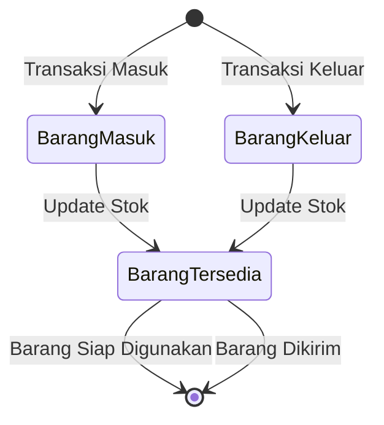

### 5.8. Contoh Kasus/Alur

**Kasus 1: Barang Masuk**

1. Admin koperasi memasukkan data barang yang masuk (misal: 50 sak pupuk).
2. Sistem menambahkannya ke inventory dan memperbarui stok.

**Kasus 2: Barang Keluar**

1. Admin koperasi mencatat barang yang keluar (misal: distribusi 10 sak pupuk ke petani A).
2. Sistem mengurangi stok dan mencatat transaksi keluar.

### 5.9. Catatan Kritis & Batasan

- Barang yang tidak terdaftar tidak bisa diproses.
- Barang keluar: Perlu memverifikasi apakah stok cukup sebelum diproses (jika tidak cukup, sistem harus menolak transaksi).
- Penjualan ke buyer: Perlu catatan transaksi yang lebih lengkap untuk keperluan invoice dan pencatatan pembayaran.

---

## 6. Batch Tracking (Cherry → Green Bean)

### 6.1. Ringkasan Tujuan
Modul ini bertanggung jawab untuk mencatat dan melacak batch kopi, dari cherry yang dipanen hingga green bean yang siap dipasarkan. Tujuannya adalah untuk traceability produk kopi dan memastikan setiap batch bisa dilacak kembali ke asalnya.

### 6.2. Entitas & Role Terlibat
- **Admin Koperasi**: Orang yang mencatat batch kopi.
- **Batch Kopi**: Setiap batch yang dihasilkan dari hasil panen (cherry) dan diproses menjadi green bean.

### 6.3. Alur Proses Utama

#### Diagram Flowchart:
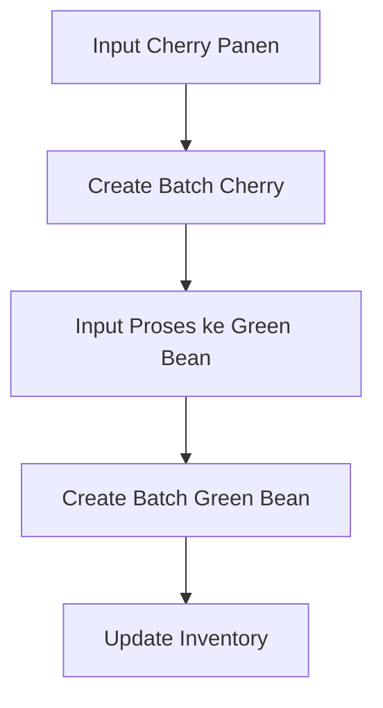

### 6.4. Input Data

| Field | Tipe | Sumber | Validasi | Wajib | Keterangan |
|-------|------|--------|----------|-------|------------|
| nama_batch | string | Admin | - | Ya | Nama atau kode identifikasi batch |
| lahan_id | integer | Admin | - | Ya | ID lahan yang terkait dengan batch |
| tanggal_panen | date | Admin | Format valid (YYYY-MM-DD) | Ya | Tanggal panen yang terkait |
| jumlah_kg | decimal | Admin | > 0 | Ya | Jumlah kg hasil cherry yang diproses |

### 6.5. Proses & Bisnis Logika

#### Cherry → Green Bean:
- Batch cherry dicatat dan dihitung jumlahnya.
- **Proses**: Admin koperasi memindahkan batch cherry ke proses green bean.
- Sistem menghasilkan batch ID untuk green bean yang akan terkait dengan batch cherry.
- **Update Inventory**: Sistem menambah green bean ke inventory dengan traceability ke batch cherry asal.

### 6.6. Output Data

| Field | Tipe | Destinasi | Format/Note |
|-------|------|-----------|-------------|
| batch_id | integer | Sistem | ID unik batch |
| lahan_id | integer | Sistem | ID lahan |
| jumlah_kg | decimal | Sistem | Jumlah batch |
| batch_type | string | Sistem | 'cherry' atau 'green bean' |

### 6.7. State/Status Diagram

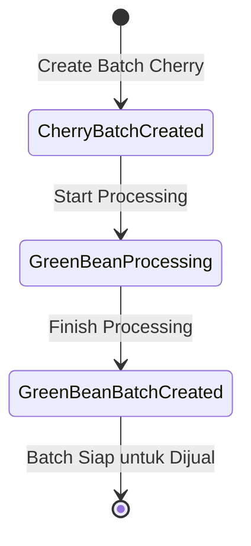

### 6.8. Contoh Kasus/Alur

**Kasus 1: Membuat Batch Cherry**

1. Admin koperasi mencatat batch cherry yang baru dipanen.
2. Sistem membuat ID batch dan mencatat jumlah hasil panen dalam kg.

**Kasus 2: Proses Batch Cherry ke Green Bean**

1. Admin koperasi mencatat bahwa batch cherry telah diproses menjadi green bean.
2. Sistem membuat ID batch green bean dan mengaitkannya dengan batch cherry.

### 6.9. Catatan Kritis & Batasan

- Batch cherry harus ada sebelum batch green bean dibuat.
- Pencatatan hasil panen harus akurat, karena langsung berpengaruh pada traceability green bean.

---

## 7. Reporting & Monitoring Dashboards

### 7.1. Ringkasan Tujuan
Modul dashboard digunakan untuk menampilkan informasi yang relevan mengenai koperasi dan kinerja nasional. Tujuannya adalah untuk memudahkan monitoring, analisis, dan perencanaan berbasis data yang terkumpul dalam sistem.

### 7.2. Entitas & Role Terlibat
- **Admin Koperasi**: Orang yang mengakses dashboard koperasi.
- **SUPER_ADMIN**: Pihak yang mengakses dashboard nasional.

### 7.3. Alur Proses Utama

#### Diagram Flowchart:
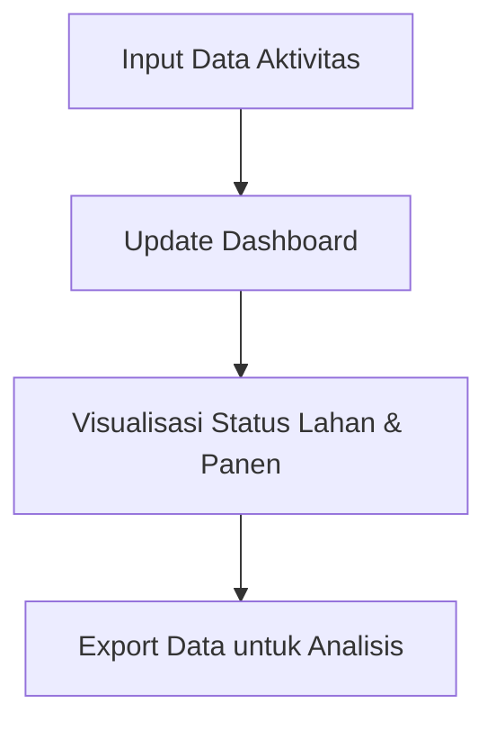

### 7.4. Output Data

| Field | Tipe | Destinasi | Format/Note |
|-------|------|-----------|-------------|
| total_koperasi | integer | Dashboard | Total koperasi aktif |
| total_petani | integer | Dashboard | Total petani terdaftar |
| total_panen | decimal | Dashboard | Total kg panen per periode |
| batch_status | string | Dashboard | Status batch kopi (in progress, ready) |

### 7.5. Catatan Kritis & Batasan

- Pembaruan dashboard dilakukan setiap kali ada input baru (panen, tanam, transaksi).
- **Visualisasi**: Bisa mencakup grafik sederhana (jumlah lahan, status panen, total kopi) menggunakan bar charts atau pie charts.
