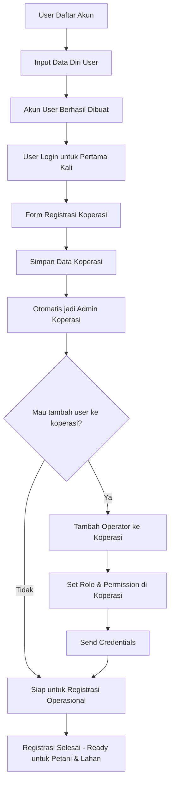
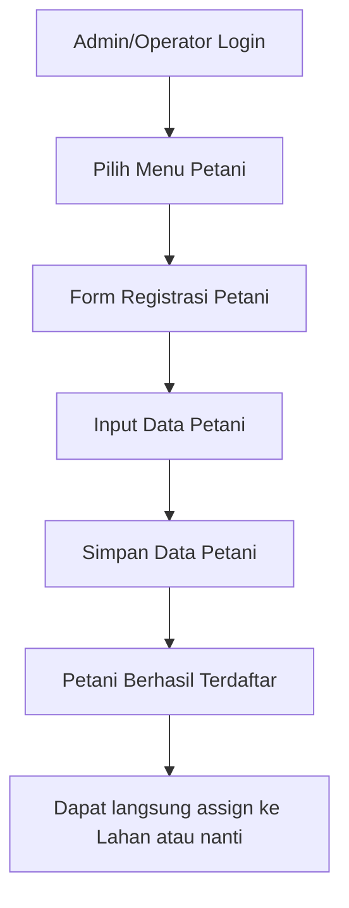
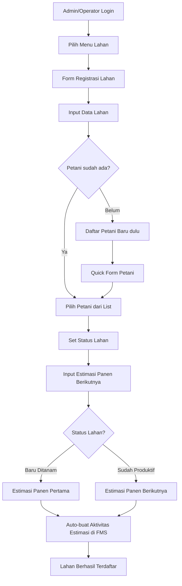
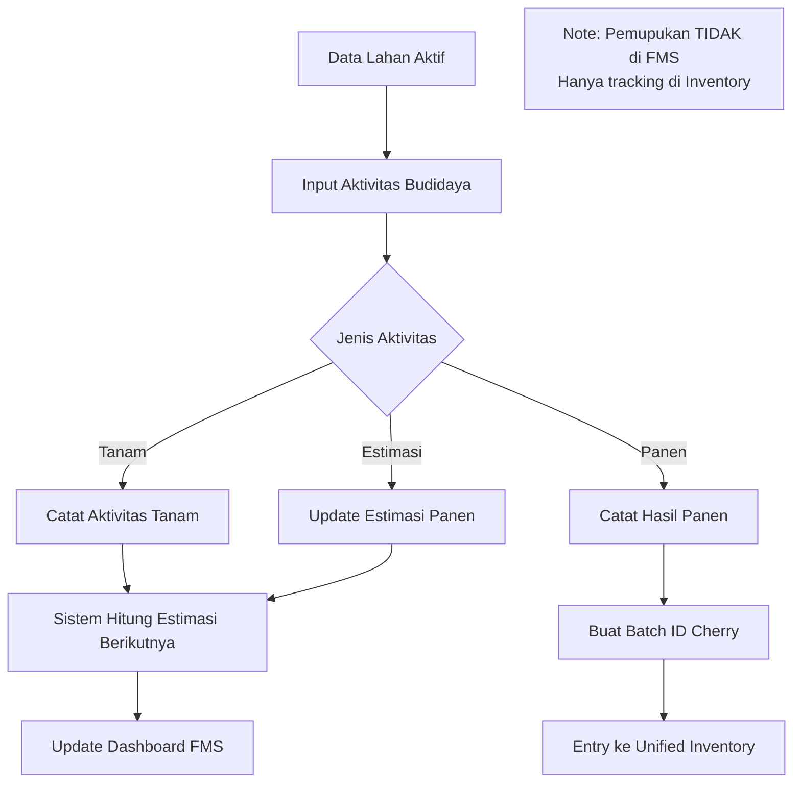
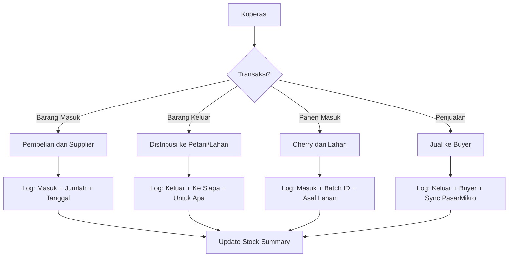
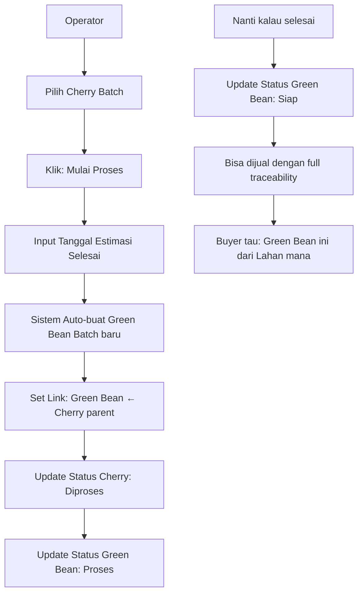
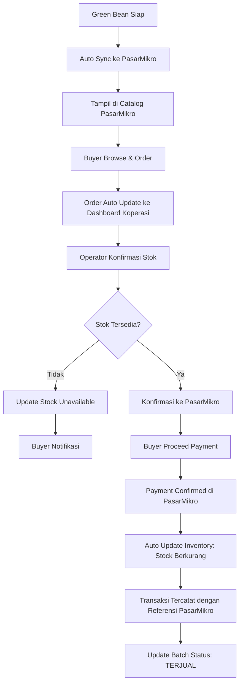
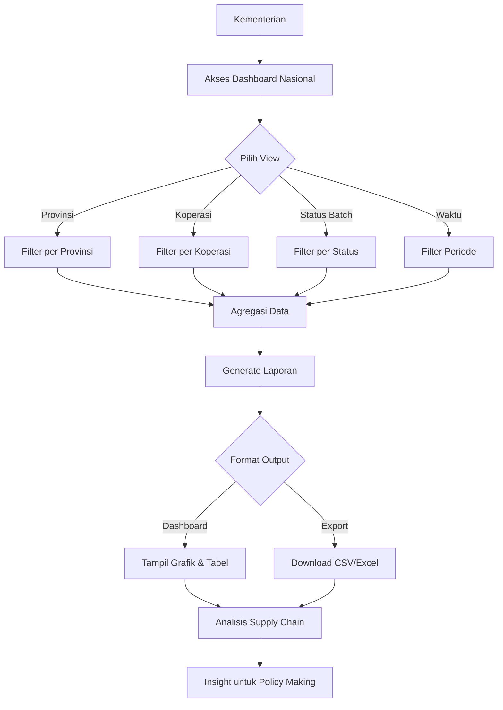
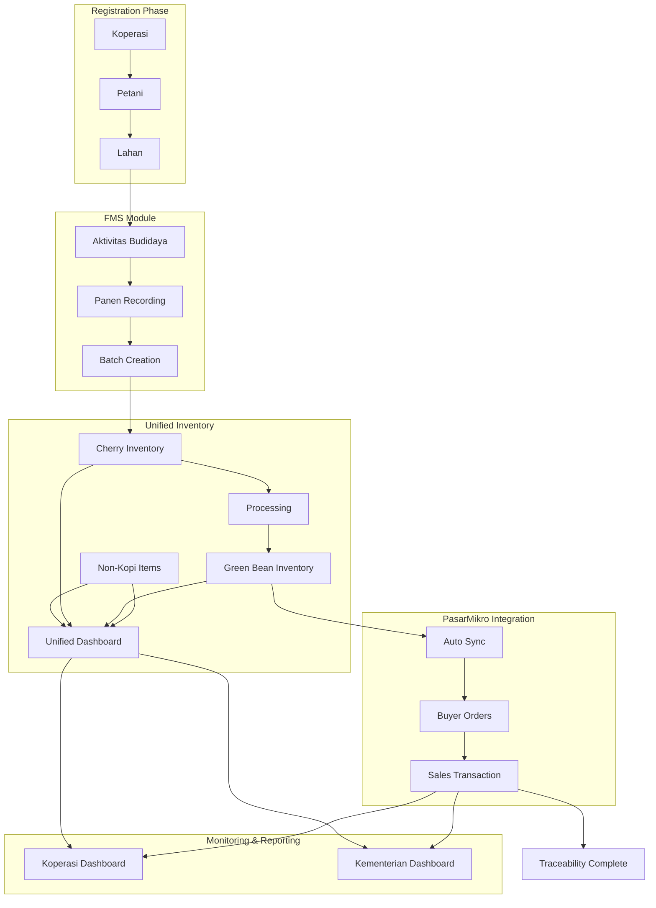

# Product Requirements Document (PRD)
## Sistem Digitalisasi & Traceability Koperasi Kopi

---

## 1. Pendahuluan

Dokumen ini menggambarkan spesifikasi teknis dan fungsional untuk pengembangan platform digital terpusat yang bertujuan untuk pencatatan, traceability, dan pemantauan aktivitas produksi kopi yang dikelola oleh koperasi di Indonesia.

**Visi produk** ini adalah menciptakan ekosistem kopi digital yang transparan dan efisien, di mana setiap biji kopi dapat dilacak dari lahan hingga ke pembeli. Sistem ini akan memberdayakan koperasi dengan data yang akurat, meningkatkan produktivitas petani, dan membuka akses pasar yang lebih luas melalui platform terpusat yang didukung oleh Kementerian Koperasi.

---

## 2. Tujuan Produk (Goals)

1. **Mencatat Seluruh Siklus Produksi**: Mendigitalisasi seluruh data dari registrasi lahan, aktivitas budidaya, manajemen inventaris (input pertanian), panen, proses pascapanen, hingga penjualan.

2. **Membangun Sistem Traceability**: Menciptakan jejak digital untuk setiap batch produk kopi, memungkinkan penelusuran asal-usul (lahan, tanggal panen) dan alur prosesnya secara transparan.

3. **Memudahkan Input Data**: Menyediakan antarmuka yang sangat mudah digunakan melalui AI WhatsApp Assistant dan Dashboard Web untuk operator koperasi.

4. **Menjadi Alat Prediksi Pasokan**: Memberikan estimasi ketersediaan produk jadi (Green Bean) di masa depan kepada koperasi, buyer, dan kementerian untuk perencanaan pasar yang lebih baik.

5. **Mendukung Pengambilan Keputusan**: Menghasilkan data akurat untuk analisis produktivitas, estimasi panen, dan sebagai dasar pengajuan pembiayaan.

6. **Memfasilitasi Integrasi Pasar**: Menyediakan data transaksi yang siap disinkronkan dengan platform pihak ketiga (PasarMikro) untuk proses penagihan dan penjualan.

---

## 3. Struktur Modul Sistem

Sistem dibagi menjadi dua modul utama yang saling terintegrasi:

### **Farm Management System (FMS)**
Fokus pada pencatatan seluruh proses agrikultur, mulai dari registrasi petani dan lahan, hingga pencatatan aktivitas budidaya dan panen.

### **Inventory Management System (IMS)**
Fokus pada pencatatan stok dan alur barang, baik input pertanian (benih, pupuk, pestisida) maupun produk kopi (Cherry, Green Bean) di gudang koperasi.

---

## 4. Alur Bisnis & Sistem Batch (Core Workflow)

### 4.1. Registrasi User & Koperasi

**Alur Baru: Operator Mendaftarkan Koperasi**

1. **Registrasi User Pertama**: 
   - Operator membuat akun user (username, password, data diri)
   - User belum terikat ke koperasi apapun
   - Status: User aktif tapi belum bisa akses fitur koperasi

2. **Registrasi Koperasi**:
   - User yang sudah terdaftar mengisi form data koperasi
   - Nama koperasi, alamat lengkap, provinsi & kabupaten, nama penanggung jawab
   - Sistem membuat record koperasi baru
   - Sistem otomatis menambahkan user ke koperasi dengan role 'ADMIN'

*Catatan: Jenis koperasi saat ini tidak wajib diisi (non-prioritas MVP)*

**Setelah registrasi koperasi selesai, Admin dapat:**

- **Menambah Operator lain** ke dalam koperasi yang sama
- **Set permission level**: Admin (full access) atau Operator (limited access)  
- **Manage user accounts**: Reset password, deactivate user, dll

**User Roles dalam Koperasi:**

- **Admin**: User pertama yang mendaftarkan koperasi (full control) + bisa tambah user baru ke koperasi
- **Operator**: Bisa input/edit data operasional, tidak bisa manage user

### 4.2. Registrasi Petani

Operator mendaftarkan seluruh petani anggota koperasi.

Data yang dicatat:

- Nama petani
- Nomor kontak
- Alamat
- ID unik (otomatis)

*Catatan: Petani di sini berarti pemilik lahan, bukan buruh tani*

### 4.3. Registrasi Lahan

Operator mencatat data tiap lahan yang dikelola koperasi:

- Nama / kode lahan
- Lokasi & alamat (bisa mencakup koordinat GPS)
- Luas (hektar)
- Estimasi jumlah pohon kopi
- Jenis kopi (arabika, robusta, dsb)
- Kepemilikan: terhubung ke petani tertentu (satu petani = pemilik satu atau lebih lahan)

### 4.4. Status Awal Lahan

Saat registrasi, lahan harus diberi status awal:

- **Baru ditanam** (belum pernah panen)
- **Sudah produktif** (sudah pernah panen)

**Untuk SEMUA lahan, dicatat estimasi panen berikutnya:**

- **Lahan Baru Ditanam**: Estimasi tanggal panen pertama (bulan/tahun)
- **Lahan Sudah Produktif**: Estimasi tanggal panen berikutnya berdasarkan siklus sebelumnya
- **Data ini masuk ke FMS** sebagai aktivitas budidaya terjadwal
- Sistem akan menggunakan data ini untuk:
  - **Prediksi supply** di dashboard kementerian
  - **Planning panen** untuk koperasi
  - **Estimasi ketersediaan** untuk buyer via PasarMikro
  - **Reminder otomatis** menjelang waktu panen (opsional)

### 4.5. Pencatatan Aktivitas Budidaya (Farm Management System)

Aktivitas pertanian per lahan yang dicatat di FMS:

- **Tanam** (tanggal, jenis bibit)
- **Panen** (tanggal, jumlah kg cherry)
- **Estimasi panen selanjutnya** (sistem bantu prediksi berdasarkan data sebelumnya)

*Catatan MVP: Pemupukan TIDAK dicatat di FMS, hanya di inventory tracking sebagai "pupuk keluar untuk lahan A". Focus FMS hanya pada milestone utama budidaya.*

### 4.6. Inventory Management Simplified (MVP)

**Konsep: Simple "IN & OUT" Tracking**

Inventory system yang simpel dengan prinsip dasar:

**Yang Ditrack:**

- **Barang Masuk**: Pembelian pupuk/benih/pestisida + Hasil panen cherry
- **Barang Keluar**: Distribusi ke petani/lahan + Penjualan kopi ke buyer

**Data Minimal:**

- **Item**: Nama barang (Pupuk Urea, Cherry Lahan A, Green Bean Batch X)
- **Tanggal**: Kapan masuk/keluar
- **Jumlah**: Berapa kg/liter/sak
- **Tipe**: Masuk atau Keluar
- **Keterangan**: Detail tambahan (misal: "dari Supplier X", "untuk Petani A", "dijual ke Buyer Y")

**Goal:**

- Tau stok apa aja yang ada
- Tau barang keluar ke siapa dan untuk apa
- Simple record keeping untuk audit

**Contoh Use Case:**

- Beli 100 sak pupuk → Catat "Masuk"
- Kasih 5 sak ke Petani A untuk Lahan B → Catat "Keluar"
- Panen 500kg cherry dari Lahan B → Catat "Masuk"
- Jual 200kg green bean ke Buyer X → Catat "Keluar"

### 4.7. Panen Kopi & Entry ke Inventory

Ketika waktu panen tiba:

- Operator mencatat hasil panen dari setiap lahan
- Yang dicatat: tanggal panen, jumlah panen (dalam kg cherry)
- Sistem otomatis membuat **Batch ID baru** untuk traceability
- Entry ke inventory sebagai: "Cherry dari Lahan X - Masuk: Xkg"

### 4.8. Tracking Bisnis Proses Pascapanen - Simplified

**Maksudnya: Tracking Cherry → Green Bean biar tau "si green bean ini asalnya dari mana"**

**Kenapa Perlu?**

- **Buyer butuh**: "Green bean ini dari lahan mana? Proses gimana?"
- **Koperasi butuh**: "Batch ini udah jadi green bean belum?"
- **Regulasi**: Traceability untuk export/sertifikasi

**Yang Di-track (Minimal):**

1. **Cherry Batch A** (dari Lahan X) masuk inventory
2. **Mulai Proses**: Cherry Batch A → diproses jadi Green Bean
3. **Selesai Proses**: Green Bean Batch B siap (anak dari Cherry Batch A)

**Praktiknya di Sistem:**

- Operator pilih Cherry Batch A
- Klik "Mulai Proses" → Set tanggal selesai estimasi
- Sistem auto-buat Green Bean Batch B dengan link ke parent (Cherry Batch A)
- Kalau ada yang tanya: "Green Bean Batch B asalnya dari mana?" → Sistem bisa jawab: "Dari Cherry Batch A, Lahan X, panen tanggal Y"

**Hasil:**

- **Traceability**: Dari Green Bean bisa lacak balik ke lahan asalnya
- **Quality Control**: Bisa tau metode proses yang dipakai
- **Market Value**: Green Bean ada "story" nya untuk premium pricing

### 4.9. Estimasi Ketersediaan Produk Jadi

Setelah cherry diproses:

- Sistem menghitung atau menampilkan estimasi kapan green bean siap
- Estimasi ini ditampilkan di dashboard koperasi, buyer, dan kementerian

**Tujuan:**

- Buyer bisa melihat lebih awal bahwa green bean akan tersedia tanggal sekian
- Sistem menjadi alat prediksi supply untuk pasar

### 4.10. Penjualan & Sinkronisasi Real-time dengan PasarMikro

Setelah green bean siap:

- **Otomatis**: Data inventory Green Bean sync ke PasarMikro catalog
- **Buyer Order**: Buyer melakukan pemesanan via PasarMikro
- **Auto Update**: Order otomatis muncul di dashboard koperasi
- **Konfirmasi**: Operator konfirmasi ketersediaan stok
- **Payment**: Pembayaran diproses di PasarMikro
- **Inventory Update**: Stok otomatis berkurang di kedua sistem
- **Recording**: Transaksi tercatat lengkap dengan referensi PasarMikro

**Data yang tercatat:**

- Buyer (dari PasarMikro)
- Batch ID yang dijual
- Jumlah (kg)
- Harga total
- Referensi transaksi PasarMikro
- Status pembayaran

### 4.11. Pelaporan & Monitoring (Kementerian)

Kementerian dapat mengakses data:

- Total panen per daerah
- Status batch (cherry, sedang proses, green bean siap)
- Estimasi panen dan stok ke depan

Semua data ditampilkan dalam bentuk:

- Tabel agregat
- Ringkasan grafik
- Filter berdasarkan provinsi, koperasi, status batch, waktu

### 4.12. Ringkasan Alur Modular

| **Tahap** | **Modul** | **Entitas Terlibat** | **Output** |
|-----------|-----------|---------------------|------------|
| Registrasi user | Core System | User | Account user |
| Registrasi koperasi | Core System | User | Data koperasi + relasi user-koperasi |
| Registrasi petani & lahan | FMS | Operator | Data petani, lahan |
| Aktivitas tanam & panen | FMS | Operator | Riwayat budidaya |
| Inventarisasi & distribusi input | IMS | Operator | Transaksi barang masuk/keluar |
| Panen kopi cherry | FMS | Operator | Batch ID cherry |
| Proses pascapanen | IMS | Operator | Batch ID green bean |
| Penjualan | IMS + PasarMikro | Operator, Buyer | Transaksi siap invoice |
| Monitoring | IMS + FMS | Kementerian | Laporan nasional |

---

## 4.13. Business Process Diagram

### 1. Alur Registrasi User & Koperasi



### 2. Alur Registrasi Petani (Dapat dilakukan kapan saja)



### 3. Alur Registrasi Lahan (Dapat dilakukan kapan saja)



### 4. Alur Farm Management System (FMS)



### 5. Simple Inventory Management



### 6. Simple Cherry → Green Bean Tracking



### 7. Alur Penjualan & Integrasi PasarMikro



### 8. Alur Monitoring & Reporting



### 9. Comprehensive System Flow



---

## 5. Fitur Utama Sistem (MVP)

### 5.1. Fitur Web Dashboard

#### **Login & User Management**

- **Multi-user Support**: Satu koperasi bisa punya multiple admin/operator
- **Role-based Access**: Admin → Operator (hierarchical permissions)
- **User Management**: Add/remove users, reset passwords, set permissions
- **Audit Log**: Track siapa yang input/edit data apa dan kapan

#### **Modul FMS (Simplified MVP):**

- **Manajemen Entitas**: Form untuk CRUD (Create, Read, Update, Delete) data Koperasi, Petani, dan Lahan.
- **Pencatatan Aktivitas Utama**: Focus pada milestone penting (Tanam, Panen, Estimasi)
- **Planning Dashboard**: Calendar view estimasi panen dan reminder

*Note: Pemupukan tracked di Inventory saja, tidak di FMS untuk MVP*

#### **Modul IMS (Simple Inventory Management):**

- **Simple IN/OUT Dashboard**: Barang masuk vs barang keluar
- **Tracking Transaksi**: Log semua pergerakan barang dengan timestamp
- **Batch Kopi**: Basic traceability cherry → green bean
- **Stock Overview**: Summary stok available per kategori
- **Sinkronisasi PasarMikro**: Auto-sync penjualan dari marketplace

#### **Dashboard & Pelaporan:**
- **Dashboard Koperasi**: 
  - Ringkasan total panen aktual vs estimasi
  - Status batch dan estimasi ketersediaan produk jadi
  - **Calendar view** estimasi panen mendatang dari FMS
  - Alert lahan yang mendekati waktu panen
- **Dashboard Kementerian**: 
  - Laporan agregat nasional dengan filter (provinsi, koperasi, status batch)
  - **Proyeksi supply nasional** berdasarkan estimasi panen FMS
  - Analisis gap antara estimasi vs realisasi panen
- **Ekspor Data**: Fitur ekspor ke CSV/Excel.

### 5.2. Fitur WhatsApp AI

- **Input Data Cepat**: Operator dapat mengirim pesan untuk mencatat transaksi umum (panen, distribusi pupuk).
- **Kueri & Koreksi Data**: Menanyakan status batch atau melakukan koreksi data sederhana.

---

## 6. Struktur Data Kunci

### User Management
| Field | Keterangan |
|-------|------------|
| user_id | ID unik user |
| username | Username untuk login |
| password_hash | Password terenkripsi |
| nama_lengkap | Nama lengkap user |
| email | Email user |
| role | 'ADMIN', 'OPERATOR' |
| is_active | Status aktif user (true/false) |
| created_by | ID user yang membuat account ini |
| created_at | Timestamp pembuatan account |
| last_login | Timestamp login terakhir |

**Catatan:**
- User tidak terikat langsung ke koperasi di tabel ini. Relasi user-koperasi diatur lewat tabel terpisah (User_Koperasi).
- User nasional/kementerian menggunakan role 'ADMIN' dengan akses lintas koperasi.
- Petani BUKAN user yang login, melainkan entitas yang didaftarkan oleh operator/admin koperasi. Data petani ada di tabel terpisah (lihat tabel Petani di bawah).

### User_Koperasi (Relasi User dengan Koperasi)
| Field | Keterangan |
|-------|------------|
| user_id | Foreign key ke User |
| koperasi_id | Foreign key ke Koperasi |
| role_koperasi | 'ADMIN', 'OPERATOR' |
| assigned_by | ID user yang menambahkan user ini ke koperasi |
| assigned_at | Timestamp penambahan ke koperasi |

### Koperasi
| Field | Keterangan |
|-------|------------|
| koperasi_id | ID unik koperasi |
| nama_koperasi | Nama resmi koperasi |
| alamat | Alamat fisik kantor pusat |
| provinsi | Provinsi lokasi koperasi |
| kabupaten | Kabupaten lokasi koperasi |
| kontak_person | Nama penanggung jawab |
| nomor_telepon | Nomor kontak resmi |
| created_by | ID user yang mendaftarkan koperasi |

### Petani
| Field | Keterangan |
|-------|------------|
| petani_id | ID unik petani (pemilik lahan) |
| koperasi_id | Foreign key ke Koperasi |
| nama | Nama lengkap petani |
| kontak | Nomor telepon petani |
| alamat | Alamat domisili petani |

### Lahan
| Field | Keterangan |
|-------|------------|
| lahan_id | ID unik lahan |
| koperasi_id | Foreign key ke Koperasi |
| petani_id | Foreign key ke Petani pemilik |
| nama_lahan | Nama atau kode identifikasi lahan |
| lokasi | Alamat/koordinat GPS lahan |
| luas_hektar | Luas lahan dalam hektar |
| estimasi_jumlah_pohon | Perkiraan jumlah pohon kopi di lahan |
| jenis_kopi_dominan | Jenis kopi utama (Arabika, Robusta, dll) |
| status_lahan | Status terkini ('Baru Ditanam', 'Produktif', 'Tidak Aktif') |
| estimasi_panen_pertama | Estimasi tanggal panen berikutnya (wajib untuk semua lahan) |

### Aktivitas Budidaya (FMS) - Simplified MVP
| Field | Keterangan |
|-------|------------|
| aktivitas_id | ID unik untuk setiap aktivitas |
| lahan_id | Foreign key ke Lahan |
| jenis_aktivitas | 'TANAM', 'PANEN', 'ESTIMASI_PANEN' (Pemupukan TIDAK di FMS) |
| tanggal_aktivitas | Tanggal pelaksanaan aktivitas |
| tanggal_estimasi | Tanggal estimasi (untuk jenis 'ESTIMASI_PANEN') |
| jumlah_estimasi_kg | Estimasi hasil panen dalam kg (khusus estimasi panen) |
| jumlah_aktual_kg | Hasil panen aktual dalam kg (khusus panen) |
| jenis_bibit | Jenis bibit yang ditanam (khusus tanam) |
| status | 'TERJADWAL', 'SELESAI', 'PENDING' |
| keterangan | Catatan tambahan aktivitas |
| created_from | 'MANUAL', 'AUTO_FROM_REGISTRATION' (untuk estimasi dari registrasi lahan) |
| created_by | Foreign key ke User yang input data |
| created_at | Timestamp input data |

**Catatan Update Data:**
- **Estimasi bisa diupdate**: Field `jumlah_estimasi_kg` dan `tanggal_estimasi` bisa diubah sebelum panen actual terjadi.
- **Actual tidak bisa diubah**: Setelah `jumlah_aktual_kg` diisi (status jadi 'SELESAI'), data ini tidak bisa diubah untuk menjaga integritas traceability.
- **Status otomatis**: Status berubah dari 'TERJADWAL' → 'SELESAI' ketika operator input data actual panen.
- **Audit log**: Semua perubahan estimasi tercatat di audit log untuk tracking revisi.

### Inventory (Simple IN/OUT Tracking)
| Field | Keterangan |
|-------|------------|
| inventory_id | ID unik untuk setiap transaksi inventory |
| koperasi_id | Foreign key ke Koperasi |
| nama_item | Nama barang (Pupuk Urea, Cherry Lahan A, Green Bean Batch X) |
| tipe_transaksi | 'MASUK' atau 'KELUAR' |
| tanggal | Tanggal transaksi |
| jumlah | Jumlah barang |
| satuan | 'kg', 'liter', 'sak', 'botol' |
| batch_id | ID batch (khusus kopi untuk traceability, null untuk non-kopi) |
| parent_batch_id | ID batch induk (khusus transformasi cherry → green bean) |
| keterangan | Catatan tambahan (misal: "dari Supplier X", "untuk Petani A", "dijual ke Buyer Y") |
| referensi_pasarmikro | ID dari PasarMikro (untuk sinkronisasi penjualan) |
| created_by | Foreign key ke User yang input data |
| created_at | Timestamp input data |

### Audit Log
| Field | Keterangan |
|-------|------------|
| log_id | ID unik audit log |
| user_id | Foreign key ke User yang melakukan aksi |
| table_name | Nama tabel yang diubah |
| record_id | ID record yang diubah |
| action | 'CREATE', 'UPDATE', 'DELETE' |
| old_values | JSON data sebelum perubahan (untuk UPDATE/DELETE) |
| new_values | JSON data setelah perubahan (untuk CREATE/UPDATE) |
| timestamp | Waktu aksi dilakukan |
| ip_address | IP address user |

### Transaksi Inventory (Unified)
| Field | Keterangan |
|-------|------------|
| transaksi_id | ID unik untuk setiap transaksi inventory |
| inventory_id | Foreign key ke Inventory |
| koperasi_id | Foreign key ke Koperasi |
| tipe_transaksi | 'MASUK', 'KELUAR', 'PROSES', 'JUAL' |
| jenis_operasi | 'PEMBELIAN', 'PANEN', 'DISTRIBUSI', 'PENJUALAN', 'TRANSFORMASI' |
| tanggal | Tanggal transaksi |
| jumlah | Jumlah yang ditransaksikan |
| petani_id | Foreign key ke Petani (jika relevan) |
| lahan_id | Foreign key ke Lahan (jika relevan) |
| buyer | Nama buyer (untuk penjualan kopi) |
| harga_total | Total nilai transaksi (opsional) |
| keterangan | Catatan tambahan |
| referensi_pasarmikro | ID referensi dari PasarMikro (untuk sinkronisasi) |

---

## 7. Integrasi Pihak Ketiga (PasarMikro)

### 7.1. Konsep Integrasi Dua Arah

Sistem koperasi akan terintegrasi penuh dengan PasarMikro sebagai Point of Sale (POS) untuk buyer, dengan sinkronisasi data dua arah:

### 7.2. Data yang Disinkronkan ke PasarMikro

- **Inventory Kopi**: Data ketersediaan Green Bean dan produk kopi lainnya
- **Informasi Batch**: Detail traceability, asal lahan, metode proses
- **Estimasi Ketersediaan**: Proyeksi kapan produk akan siap
- **Harga dan Spesifikasi**: Detail produk untuk katalog buyer

### 7.3. Data yang Disinkronkan dari PasarMikro

- **Transaksi Penjualan**: Data pembelian buyer secara real-time
- **Status Pembayaran**: Konfirmasi pembayaran dan invoice
- **Data Buyer**: Profil dan preferensi buyer
- **Order Planning**: Permintaan dan reservasi dari buyer

### 7.4. Mekanisme Sinkronisasi

- **Real-time Sync**: Perubahan inventory langsung update ke PasarMikro
- **Webhook Integration**: PasarMikro mengirim notifikasi transaksi ke sistem koperasi
- **API Bidirectional**: RESTful API untuk pertukaran data dua arah
- **Conflict Resolution**: Sistem penanganan konflik data jika ada perbedaan

### 7.5. Workflow Integrasi

```
Sistem Koperasi <-> PasarMikro

1. Koperasi input inventory -> Auto sync ke PasarMikro catalog
2. Buyer order via PasarMikro -> Auto update di dashboard koperasi
3. Konfirmasi stok dari koperasi -> Update availability di PasarMikro
4. Payment confirmed di PasarMikro -> Update sold status di sistem koperasi
```

### 7.6. Keuntungan Integrasi Dua Arah

- **Real-time Inventory Management**: Stok selalu tersinkron
- **Automated Sales Recording**: Transaksi otomatis tercatat di kedua sistem
- **Better Market Intelligence**: Data buyer dan trend penjualan
- **Reduced Manual Work**: Operator tidak perlu input ulang data penjualan

---

## 8. Batasan MVP & Rencana Pengembangan

### 8.1. Yang TIDAK Termasuk dalam MVP

- **Manajemen Inventori Otomatis & Real-time**: Sistem di MVP hanya mencatat peristiwa masuk/keluar. Sistem tidak secara otomatis menghitung "Sisa Stok Live" atau memberikan peringatan stok menipis.

- **Manajemen Inventori Kompleks**: Fitur seperti stok opname, perhitungan penyusutan (shrinkage), dan valuasi inventori tidak termasuk.

---

## 9. Tech Stack

- **Web App**: React / Vue + Backend (Python / Node.js)
- **Database**: PostgreSQL / MongoDB dan Google BigQuery
- **WhatsApp Bot**: Gemini AI

---

*Dokumen ini merupakan panduan teknis untuk pengembangan Sistem Digitalisasi & Traceability Koperasi Kopi yang bertujuan menciptakan transparansi dan efisiensi dalam rantai pasok kopi Indonesia.*
